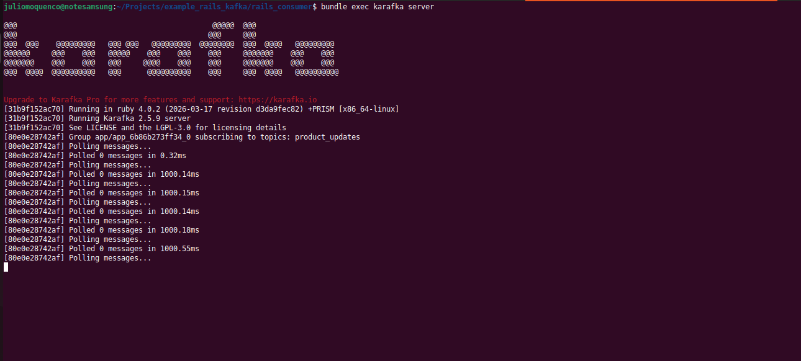
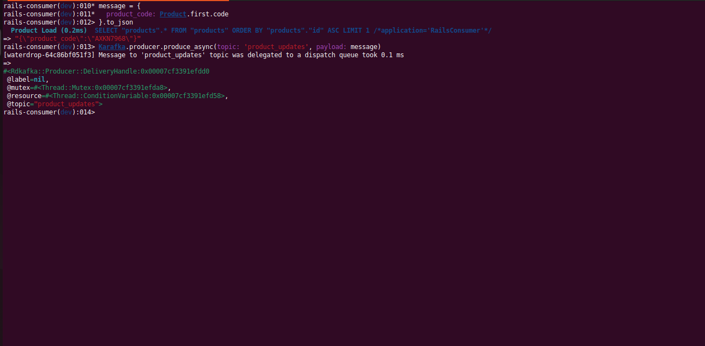
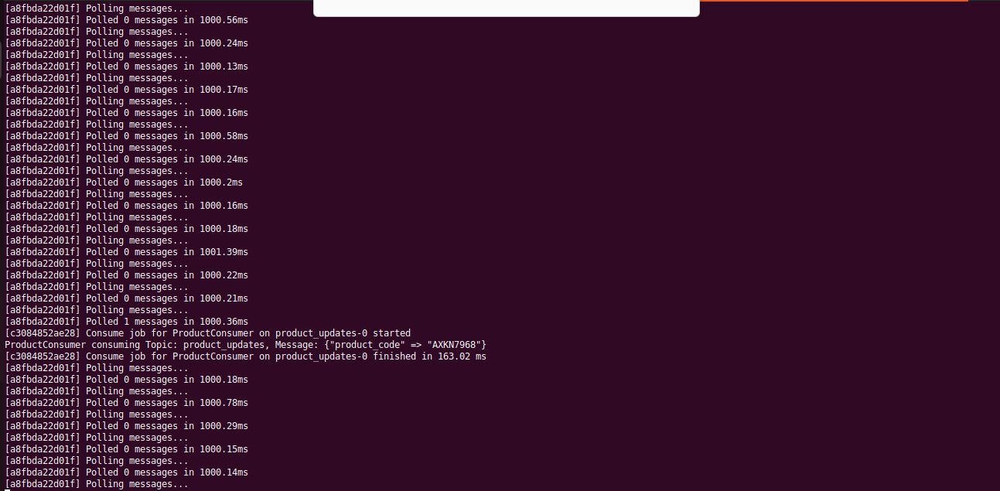

# Projeto de exemplo utilizando Apache Kafka + ROR
\
Comando para montarmos o container do Kafka:
\
\
**docker-compose up**
\
\
\
Com duas abas do terminal abertas, umas delas você executa o Kafka com estes comandos:
\
\
**cd rails_consumer**
**bundle exec karafka server**
\
\

## Exemplo de como produzir e consumir mensagem no kafka
Na outra aba do terminal, abra o irb e realiza uma produção de mensagem no kafka, conforme o exemplo abaixo:
\
\
**cd rails_consumer**
\
**bundle exec rails c**
\
**message = { product_code: Product.first.code }.to_json**
\
**Karafka.producer.produce_async(topic: 'product_updates', payload: message)**
\
(Aba A - Produzi mensagem pelo IRB, mas poderia ser por outro projeto, microserviço..., desde que utilizem a mesma base de dados.)

\
(Aba B - Consumindo mensagens)
